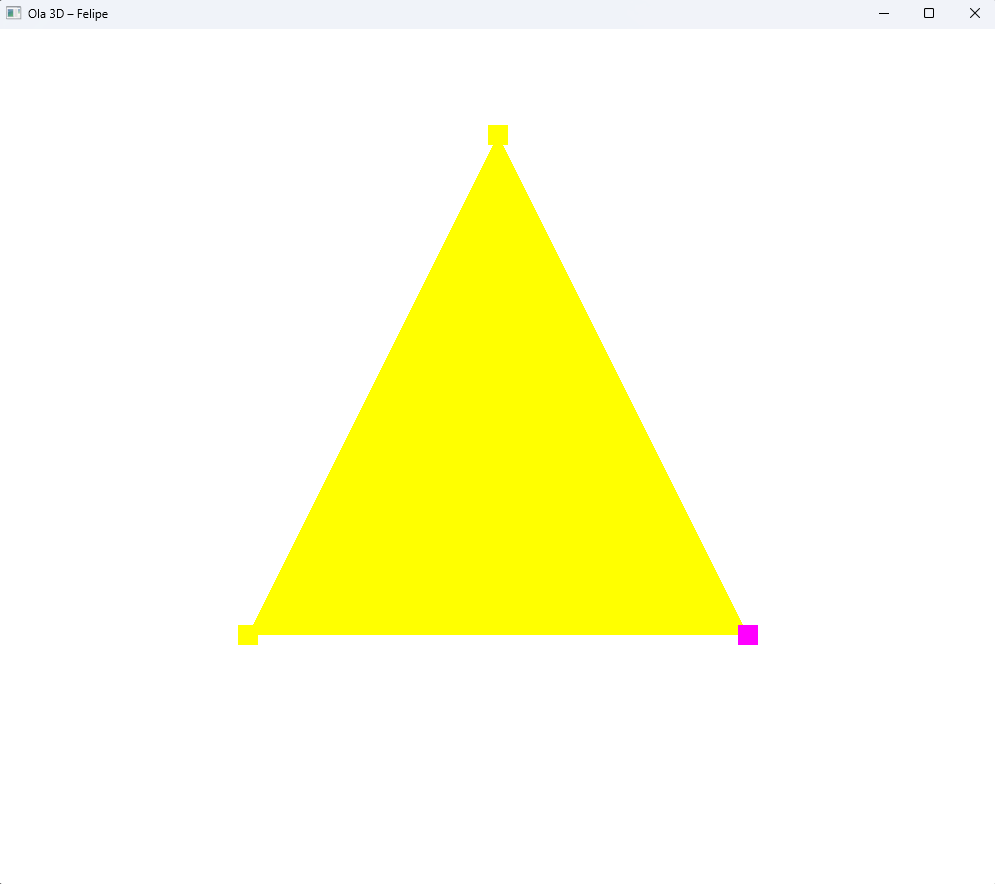

# 🎨 Resposta ao Desafio do Módulo 1

## 📌 Objetivo

O exercício **RespostaAoDesafio** foi adicionado ao repositório e adaptado conforme o ambiente local.

### ✔️ Alterações realizadas:

- Alteração do título da janela para:

```
Ola 3D – Felipe
```

- Ajustes necessários para compilação e execução no ambiente configurado

---

## 🛠️ Configuração do Ambiente

A configuração do ambiente foi realizada com base no guia:

🔗 https://github.com/FNBergamo/CGCCHibrido/blob/main/GettingStarted.md

Foram instaladas e configuradas as dependências necessárias para execução de aplicações com OpenGL.

---

## 📁 Estrutura do Repositório

```
/
├── RespostaAoDesafio/        # Projeto base adaptado
└── README.md       # Documentação da atividade
```

## ▶️ Como executar

1. Clone o repositório:

```bash
git clone https://github.com/FNBergamo/CGCCHibrido
```

2. Siga as instruções de instalação, build e configuração em:

🔗 https://github.com/FNBergamo/CGCCHibrido/blob/main/GettingStarted.md

3. Ao executar o binário gerado, use `RespostaAoDesafio.exe` em vez de `Hello3D.exe`:

```bash
./RespostaAoDesafio.exe
```

> Observação: no Linux/macOS o binário pode não ter extensão — execute `./RespostaAoDesafio`.

---

## 🖼️ Resultado

Abaixo está o print da execução do programa:



---

## 📚 Referências e Materiais de Apoio

- https://learnopengl.com/Getting-started/OpenGL
- https://learnopengl.com/Getting-started/Hello-Triangle
- https://learnopengl.com/Getting-started/Shaders
- https://antongerdelan.net/opengl/hellotriangle.html
- http://www.opengl-tutorial.org/beginners-tutorials/tutorial-2-the-first-triangle/

---

## 📌 Entrega

A entrega consiste no link deste repositório contendo:

- Projeto configurado e funcional
- Alteração no título da janela
- Evidência de execução (print incluído neste README)
