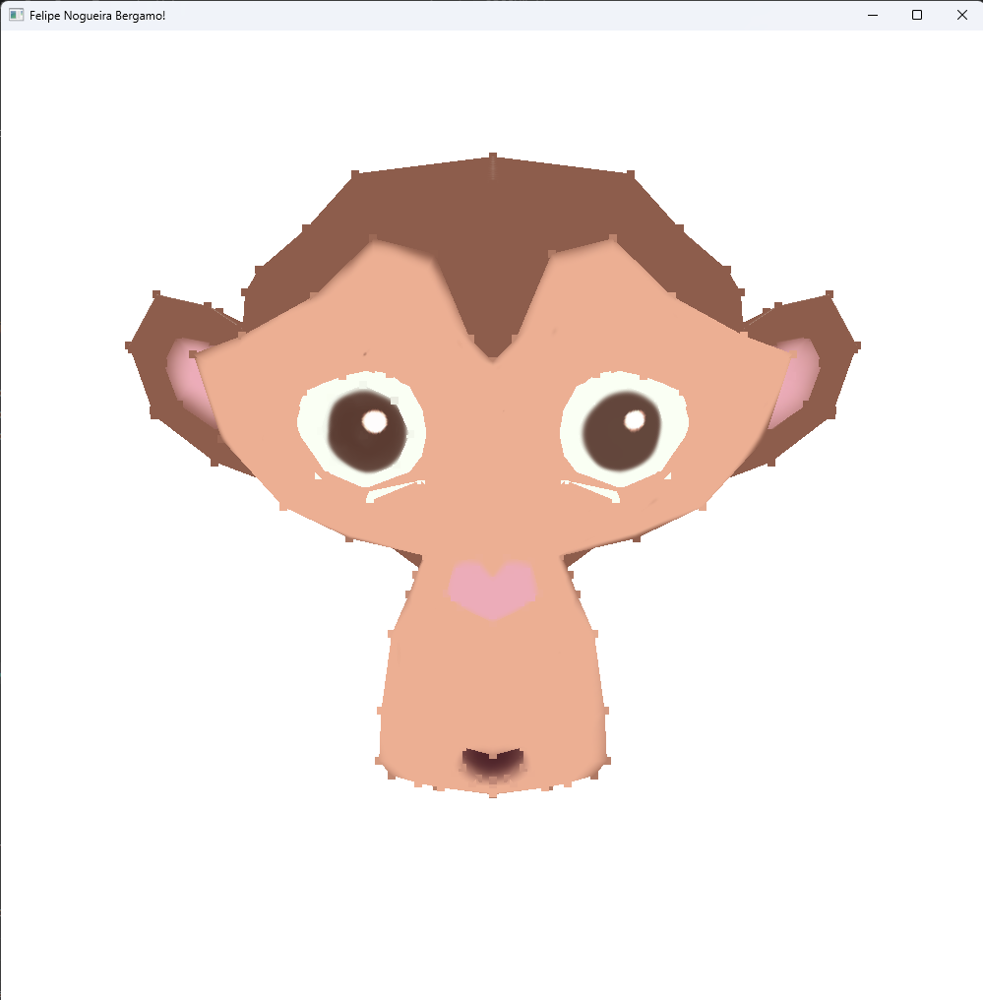

# 🎨 Resposta ao Desafio do Módulo 3

## 📌 Objetivo

O exercício **RespostaAoDesafioModulo3** foi desenvolvido com o objetivo de expandir o visualizador OBJ implementado anteriormente, adicionando suporte a texturas através da leitura de arquivos `.OBJ` e `.MTL`.

### ✔️ Funcionalidades implementadas:

- Leitura das coordenadas de textura (`vt`) presentes no arquivo `.OBJ`
- Armazenamento das coordenadas UV como atributo dos vértices
- Leitura das informações de materiais no arquivo `.MTL`
- Identificação e carregamento do nome da textura associada ao material
- Implementação do renderizador com suporte a objetos texturizados em OpenGL
- Integração baseada no código de apoio `LoadSimpleOBJ.cpp`

---

## 🛠️ Configuração do Ambiente

A configuração do ambiente foi realizada com base no guia:

🔗 [https://github.com/FNBergamo/CGCCHibrido/blob/main/GettingStarted.md](https://github.com/FNBergamo/CGCCHibrido/blob/main/GettingStarted.md)

Foram instaladas e configuradas as dependências necessárias para desenvolvimento utilizando:

- OpenGL
- GLFW
- GLAD
- stb_image (para carregamento de texturas)
- Compilador C++ compatível

---

## 📁 Estrutura do Repositório

```text
/
├── RespostaAoDesafioModulo3/   # Projeto do desafio do módulo 3
└── README.md                   # Documentação da atividade
```

---

## ▶️ Como executar

1. Clone o repositório:

```bash
git clone https://github.com/FNBergamo/CGCCHibrido
```

2. Siga as instruções de instalação, build e configuração em:

🔗 [https://github.com/FNBergamo/CGCCHibrido/blob/main/GettingStarted.md](https://github.com/FNBergamo/CGCCHibrido/blob/main/GettingStarted.md)

3. Compile o projeto correspondente ao módulo 3.

4. Execute o binário gerado:

```bash
./RespostaAoDesafioModulo3.exe
```

> Observação: no Linux/macOS o binário pode não possuir extensão — utilize `./RespostaAoDesafioModulo3`.

---

## 🖼️ Resultado

Abaixo está o print da execução do programa com o objeto texturizado:

```md

```

---

## 📚 Conceitos trabalhados

Durante o desenvolvimento deste desafio foram aplicados os seguintes conceitos:

- Estrutura de arquivos `.OBJ`
- Estrutura de arquivos `.MTL`
- Coordenadas UV
- Mapeamento de textura
- Vertex Attributes
- Texture Sampling
- Pipeline gráfico com OpenGL
- Carregamento de imagens para GPU

---

## 📌 Entrega

A entrega consiste no link deste repositório contendo:

- Implementação da leitura de coordenadas de textura no `.OBJ`
- Leitura das informações de textura do `.MTL`
- Renderização de objetos texturizados
- Projeto configurado e funcional
- Evidência de execução (print incluído neste README)
