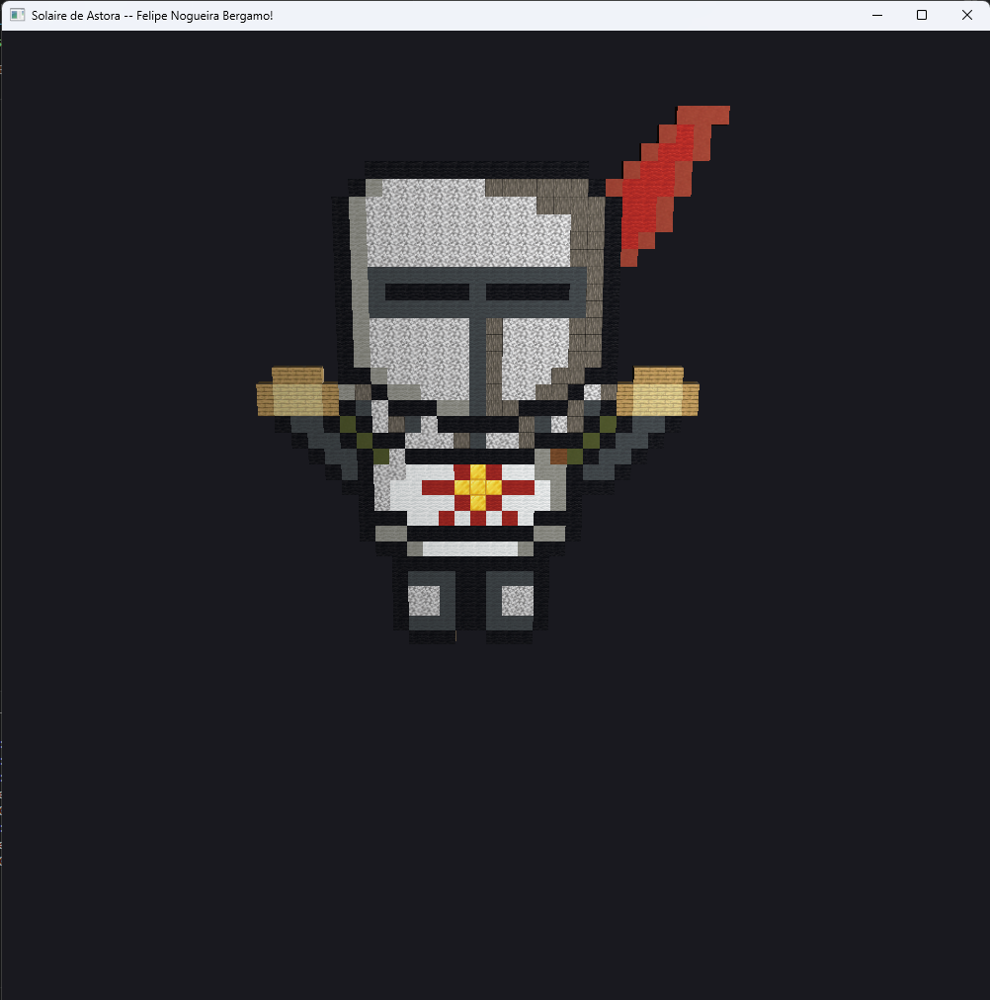

# 🎨 Resposta ao Desafio do Módulo 4

## 📌 Objetivo

Implementar o modelo de iluminação de Phong no visualizador OBJ existente. Especificamente:

- Ler e usar as normais de vértice (`vn`) do `.obj` como atributo de vértice;
- Ler os coeficientes de material (`Ka`, `Kd`, `Ks`, `Ns`) no `.mtl` e passá‑los ao shader como `uniforms`;
- Calcular as parcelas ambiente, difusa e especular no `fragment shader` (modelo de Phong) e combinar com textura/cor base.

---

## ✅ Principais alterações / funcionalidades

- Parser OBJ estendido para reconhecer `vn` (normais) e índices relativos/absolutos;
- Parser MTL que extrai `Ka`, `Kd`, `Ks` e `Ns` e resolve `map_Kd` para texturas;
- VAO configurado com novo atributo de normal (`location = 2`);
- Vertex shader atualizado para receber `normal` e transmitir ao fragment shader;
- Fragment shader implementa cálculo Phong (ambiente + difusa + especular) e aplica textura quando disponível;
- Fallback: quando o OBJ/MTL falha, renderiza um cubo colorido para evitar crash.

---

## 🛠️ Configuração do Ambiente

Siga o guia geral de setup do repositório:

🔗 https://github.com/FNBergamo/CGCCHibrido/blob/main/GettingStarted.md

Dependências principais:

- OpenGL
- GLFW
- GLAD (arquivo `common/glad.c` necessário)
- GLM
- stb_image (carregamento de texturas)

---

## 📁 Estrutura do Módulo

```
src/ExerciciosAula/Modulo4/
├── RespostaAoDesafio.cpp    # Código principal (parser, VAO, shaders)
├── README.md                # Este arquivo
assets/Modelos3D/
├── astora.obj               # Exemplo de modelo usado
├── astora.mtl               # Material associado
├── astora.png               # Textura (se aplicável)
```

---

## ▶️ Como executar

1. Abra o PowerShell no diretório do projeto e gere/compile com CMake:

```powershell
# a partir da raiz do repositório
mkdir -p build      # no Windows PowerShell, use: New-Item -ItemType Directory -Name build -Force
cd build
cmake ..
cmake --build .
```

2. Execute o binário correspondente ao módulo 4 (a partir da pasta `build`):

```powershell
.\Modulo4_RespostaAoDesafio.exe
```

Observação: no Linux/macOS, execute `./Modulo4_RespostaAoDesafio` (sem `.exe`). Evite executar o binário do Windows diretamente no `bash` do MSYS/MinGW/Cygwin, pois pode retornar `127` dependendo do ambiente — use PowerShell ou CMD.

---

## 🖼️ Resultado esperado

O programa deve abrir uma janela e renderizar o objeto carregado com iluminação Phong aplicada. Se houver texturas referenciadas, elas serão aplicadas.

Abaixo está o print da execução do programa:



---

## 🧭 Debug / Troubleshooting

- `Falha ao tentar ler o arquivo`: arquivo `.obj` não encontrado ou caminho incorreto;
- `Falha ao processar face do OBJ:`: face com índices incompatíveis — verifique se o OBJ usa `v/vt/vn` e se as faces estão trianguladas (ou são tratadas pelo parser);
- Se textura não aparecer, confirme que o caminho em `map_Kd` no `.mtl` está correto e que a imagem existe em `assets/Modelos3D/`.

---

## 📚 Referências

- https://learnopengl.com/ (capítulos sobre Shaders e Lighting)
- Documentação Wavefront OBJ / MTL

---

## 📌 Entrega

- Código fonte em `src/ExerciciosAula/Modulo4/RespostaAoDesafio.cpp`;
- Evidência de execução (print na pasta `assets/Screenshots/Modulo4/RespostaAoDesafio/result.png`).
